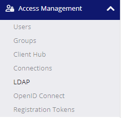

# CipherTrust and Active Directory

Note - this article was originally posted on Hal's blog on March 21, 2023 under the title "Thales CipherTrust & Active Directory."

 Why should you integrate Thales CipherTrust with your Microsoft Active Directory? What are the benefits of integration, and how is it done? Does Thales CipherTrust Manager (CTM) replace your Active Directory Group policy?

In the previous blog post, we went through the deployment of the CipherTrust Manager in our VMware environment. In today’s post, we will focus our discussion on how to integrate the newly provisioned OVA with the company Active Directory, a necessary step for activities we will discuss in our future posts.

## The Why

To streamline the management of your company’s security requirements, and to easily manage your access and control of the company files and directories, it is a good idea to integrate CTM with Active Directory as a source of user management. By doing this, you can assign your policies more easily by basing them on the company AD Users and Groups.

## The How

Now let’s focus on the fun technical part, the integration. The first step before we start the configuration is to get some information from AD; so, let’s run the following PowerShell command to retrieve the necessary information for our configuration: 

The output will be as shown below:

After you have retrieved the above information, we are ready to head back to our CTM and browse to: Access Management -> LDAP. From the top right corner, select “+ Add LDAP“:

On the pop-up config windows, provide the following information:
* Connection Name: any
* Server URL: your AD IP/DNS name
* Bind DN: CN=Administrator,CN=Users,DC=oasis,DC=org
* Server Bind Password: account password
* Rood DN: DC=oasis,DC=org
* User login name attribute: sAMAccountName

After you have tested the configurations to be correct and are ready to accept it, click on the “Add LDAP” button at the bottom right corner.

## Conclusion

Today’s blog is very important; this post is setting the foundation for our next exciting topic, Thales Transparent Encryption feature. As you may have noticed, to integrate the CTM with AD is a very simple, but important operation. Next week, we going to use the configuration setup today to access and encrypt the company’s critical data.