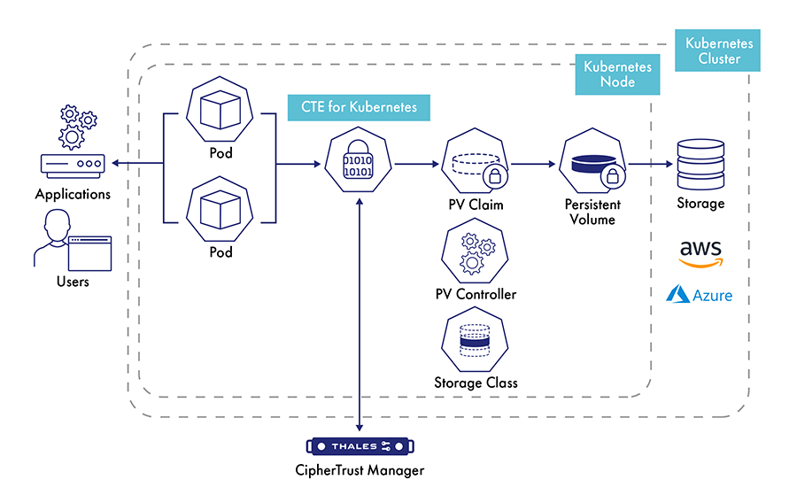

# Transparent Encryption for Kubernetes

Transparent Encryption for Kubernetes enables protection of sensitive data on persistent volumes via encryption, user and process-based access controls, and data access logging. This solution enables developers to establish security controls inside of containers. With this extension for CipherTrust Transparent Encryption, data protection can be applied on a per-container basis, both to data inside of containers and to external storage accessible from containers.

More Tutorials on Transparent Encryption for Kubernetes coming soon. Meanwhile, stay tuned for updates on our **[community forum](https://supportportal.thalesgroup.com/community)**.

import TutorialFooter from '@site/src/components/TutorialFooter';

<TutorialFooter />