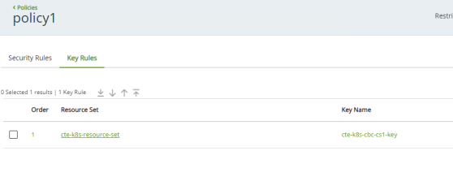

# Transparent Encryption for Kubernetes

To get started with running CipherTrust's Transparent Encryption connector with Kubernetes, you would need to first have a deployed CipherTrust Manager instance. To learn about how to deploy CipherTrust Manager, check out our [guides](../deploy/azure.mdx).

## Kuberenetes Setup
There are some pre-requisites we need to check. Our VM must have installed versions of:
* KVM
* Docker
* Kubernetes
* helm
* Minikube
* Git
* A Kubernetes cluster health monitoring tool

Note: If you prefer, you could also perform this deployment with microK8s. This would remove the need to install services like MiniKube, KVM, Kubernetes, etc

## Deploy CTE for Kubernetes
Once you have confirmed you have the pre-requisites to deploy CTE for K8s. You can run a test setup with an [open-source demo](https://github.com/thalescpl-io/ciphertrust-transparent-encryption-kubernetes) by Thales. Run,

```bash
git clone https://github.com/thalescpl-io/ciphertrust-transparent-encryption-kubernetes.git
cd ciphertrust-transparent-encryption-kubernetes/
./deploy.sh
```

## Configuring CipherTrust to talk to the Kubernetes Cluster
First, we need to generate a new registration token on the CipherTrust platform. We can do this by going to `Access Management -> Registration Token -> "Add Registration Token"`

We also need to enable the CipherTrust trial license, we can do this by going to `Licensing -> "Add CipherTrust Platform Evaluation"` to enable the evaluation license.

# Setup the K8s Client
* Go to `Clients -> K8s Storage Group`. Create a new K8s storage group.


* Go to `Policies -> Create Policy` named `policy1`

    
* Permissions to set
    * Action: `all_ops`
    * Effect: `permit, audit, applykey`

* Create a new `CBC-CS1` key, and bind it to the resource set `cte-k8s-resource-set`


Finally, click on Create Policy!

## Configure an NFS volume to protect your file system

* Create a shared folder for the NFS
```bash
sudo mkdir –p /usr/nfs/cte-k8s
```

* Specify the share location to export
```bash
sudo vim  /etc/exports

## Add the following line to the file
/usr/nfs/cte-k8s *(rw,sync,no_root_squash)
```

Save the file and run
```bash
sudo exportfs –a
```

## Start the NFS service
```bash
sudo systemctl enable nfs && \
sudo systemctl start nfs && \
sudo systemctl enable rpcbind && \
sudo systemctl start rpcbind
```


## Configure the NFS volume in the Kubernetes cluster
Create the following files
```yaml title="nfs-pv.yml"
apiVersion: v1
kind: PersistentVolume
metadata:
 name: nfs-test-pv
spec:
 capacity:
 storage: 1Gi
 accessModes:
 - ReadWriteMany
 storageClassName: nfs
 persistentVolumeReclaimPolicy: Retain
 mountOptions:
 - hard
 - nfsvers=4.0
 nfs:
 path: /usr/nfs/cte-k8s/
 server: 10.10.10.7
 ```

 ```yaml title="nfs-claim.yml"
apiVersion: v1
kind: PersistentVolumeClaim
metadata:
 name: nfs-test-claim
spec:
 storageClassName: nfs
 accessModes:
 - ReadWriteMany
 resources:
 requests:
 storage: 1Gi
```

Update the following files accordingly
```yaml title="cte-csi-storageclass.yaml"
apiVersion: storage.k8s.io/v1
kind: StorageClass
metadata:
 name: cte-k8s-storage-class
provisioner: csi.cte.cpl.thalesgroup.com
reclaimPolicy: Delete
volumeBindingMode: Immediate
allowVolumeExpansion: true
parameters:
 # Domain name or IP address of the CiperTrust Manager (Required)
 key_manager_addr: <CM_INSTANCE_IP> #This IP address is the CM internal IP address
 # Name of the CipherTrust Manager K8s Storage Group. (Required)
 k8_storage_group: cte-k8s-storage-group
 # Kubernetes Secret with CM registration token (Required)
 registration_token_secret: demo #This name needs to be the same name of the registration token in CM

 client_description: "Azure CTE k8s client"
 # Time in minutes to wait before unregistering from the CiperTrust Manager
 # once all volumes have been unguarded. Parameter must be added as a string
 # integer value. Default "10" minute. (Optional)
 registration_period: "10"
```


```yaml title="cte-csi-regtoken.yaml"
apiVersion: v1
kind: Secret
metadata:
 name: demo #This is the name of the registration tokens from CM dashboard for CTE k8s
type: Opaque
data:
 # This is a base64 encoded registration token. To generate:
 # echo <CM REGISTRATION TOKEN STRING> | base64 -w 0
 registration_token: <YOUR_REG_TOKEN>
```

```yaml
apiVersion: v1
kind: PersistentVolumeClaim
metadata:
 name: cte-claim
 annotations:
 # CTE for Kubernetes GuardPolicy name. This GuardPolicy is located on the
 # CipherTrust Manager and should match a policy name available on the
 # storage class for this PVC. (Required)
 csi.cte.cpl.thalesgroup.com/policy: policy1
 # Name of the unprotected source PVC that will be protected by this CTE-PVC.
 # (Required)
 csi.cte.cpl.thalesgroup.com/source_pvc: nfs-test-claim
spec:
 storageClassName: cte-k8s-storage-class
 accessModes:
 - ReadWriteMany
 resources:
    requests:
    # This parameter is required by Kubernetes but ignored by CTE-CSI.
    storage: 1Gi
```

```yaml title="cte-csi-demo-pod.yml"
apiVersion: v1
kind: Pod
metadata:
 name: cte-csi-demo
spec:
 volumes:
 - name: test-vol
 persistentVolumeClaim:
 claimName: cte-claim
 containers:
 - name: ubuntu
 image: ubuntu
 volumeMounts:
 - mountPath: "/data"
 name: test-vol
 command:
 - "sleep"
 - "604800"
 imagePullPolicy: IfNotPresent
 restartPolicy: Always
```

## Deploy all YAML files
```bash
kubectl apply -f nfs-pv.yaml
kubectl apply -f nfs-claim.yaml
kubectl apply -f cte-csi-regtoken.yaml
kubectl apply -f cte-csi-storageclass.yaml
kubectl apply -f cte-csi-claim.yaml
kubectl apply -f cte-csi-demo-pod.yaml
```

### Verify deployment status
```bash
kubectl get all
kubectl get pod, pv, pvc
kubectl get pod –namespace=kube-system
```

### Get Pod, PV, and PVC details
```bash
kubectl describe pod <pod name>
kubectl describe pv <pv name>
kubectl describe pvc <pvc name>
```

Now your data should be secured by CTE for K8s connector. You can verify this by going into the pod and creating a new file in the `/data` folder and verify that it is encrypted on the NFS from your local system.