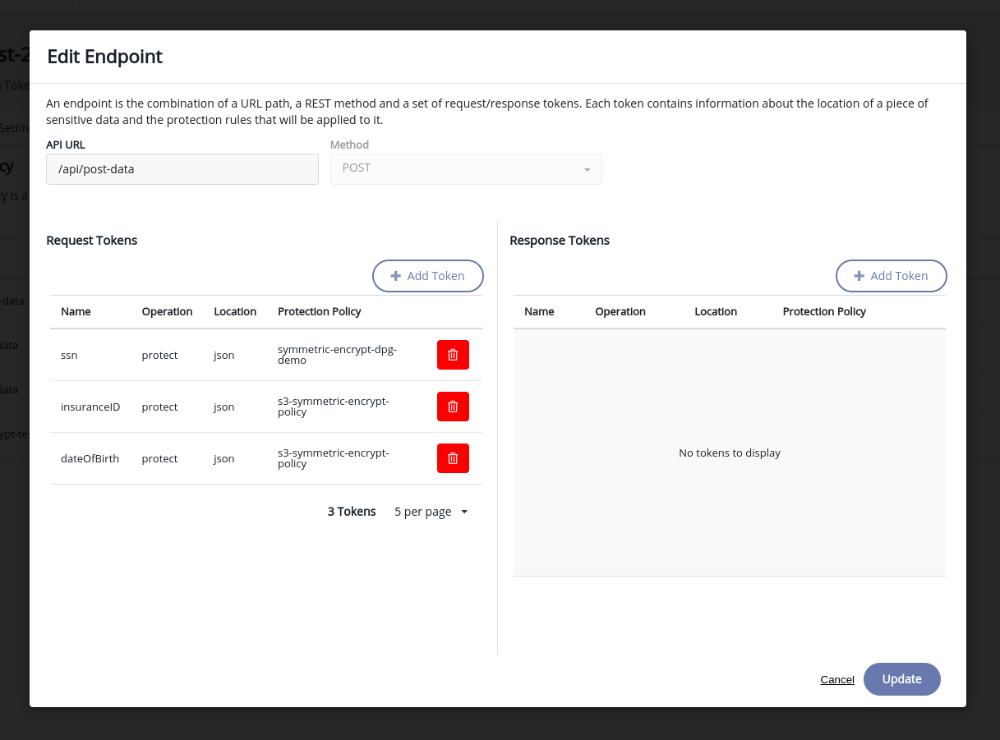

# Data Encryption in-Transit in a Docker Deployment

This demo shows how you can use a tool like CipherTrust Data Protection Gateway and do field level data encryption with **no change** to your application's code.

import YoutubeEmbed from '@site/src/components/YoutubeEmbed';

<YoutubeEmbed embedId="EJun5McPRGY" github="https://github.com/snpranav/data-encryption-in-transit-demo" demourl="https://main-yak.sneakpeak.dev/" />

## Pre-requisites
- [Deployed Ciphertrust Manager instance](../../category/deploy-ciphertrust-platform)

## How does it work?
### Step 1 - Add side-car container
You need to deploy a sidecar container or an agent that proxies all your requests to your container.

It looks something like this if you use [docker-compose](https://docs.docker.com/compose/).
Note - You can use DPG and CipherTrust manager with any other Kubernetes or Helm deployment.
```yaml title="docker-compose.yml"
version: '3.1'

services:
  ciphertrust:
    image: thalesgroup/ciphertrust-data-protection-gateway:latest
    container_name: ciphertrust
    environment:
      - REG_TOKEN=<YOUR_DPG_REG_TOKEN>
      - DESTINATION_URL=http://nextjs:3000
      - DPG_PORT=9005
      - TLS_ENABLED=false
      - KMS=<YOUR_CM_IP>
    ports:
      - 80:9005
```

### Step 2 - Configure DPG policies
Setup [DPG policies](https://thalesdocs.com/ctp/cm/latest/admin/adp_ag/adp-prtcn-policy/create-prtcn-policy/index.html) in CipherTrust Manager to encrypt the fields that are encrypted for your POST requests and add a decrypt policy for your HTTP "GET" requests.

This ensures that the proxy takes care of the encryption and decryption and the database finally ONLY gets encrypted data.



### Step 3 - Sit Back and Relax
Let CipherTrust Manager do all the magic for you while you focus on building great applications.