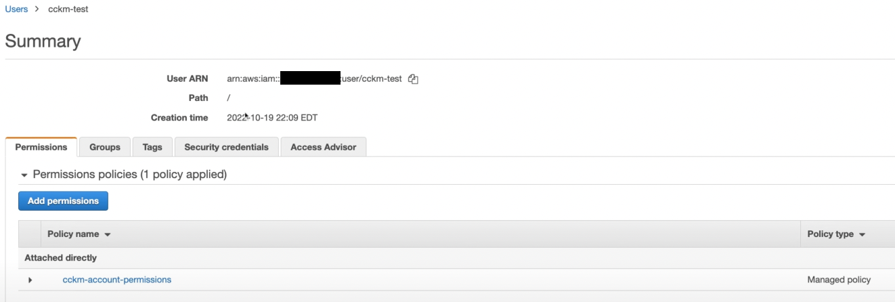

# Encrypt RDS with AWS KMS

import YoutubeEmbed from '@site/src/components/YoutubeEmbed';

<YoutubeEmbed embedId="9Cs9s7DpJFU" />

## Pre-requisites
- [Deployed Ciphertrust Manager instance](../category/deploy-ciphertrust-platform)

### Goals
- Setup CipherTrust Cloud Key Manager (CCKM) with AWS KMS
- Create Keys on CipherTrust Manager
- Encrypt RDS and S3 with the secure external key manager - CCKM


### Step 1 - Create IAM User Policies
Select the IAM user you want to use to connect with CipherTrust Manager.


Go to the permissions tab and create a new policy with the following permissions.
```json title="AWS IAM Permission JSON"
{
    "Version": "2012-10-17",
    "Statement": [
        {
            "Effect": "Allow",
            "Action": [
                "kms:DisableKey",
                "kms:ListAliases",
                "kms:ListKeyPolicies",
                "kms:ListKeys",
                "kms:ListResourceTags",
                "kms:DescribeKey",
                "kms:GetKeyPolicy",
                "kms:GetKeyRotationStatus",
                "kms:GetParametersForImport",
                "kms:GetPublicKey",
                "kms:TagResource",
                "kms:UntagResource",
                "kms:CancelKeyDeletion",
                "kms:CreateAlias",
                "kms:CreateKey",
                "kms:DeleteAlias",
                "kms:DeleteImportedKeyMaterial",
                "kms:DisableKey",
                "kms:DisableKeyRotation",
                "kms:EnableKey",
                "kms:EnableKeyRotation",
                "kms:ImportKeyMaterial",
                "kms:ScheduleKeyDeletion",
                "kms:UpdateAlias",
                "kms:UpdateKeyDescription",
                "kms:PutKeyPolicy",
                "iam:ListGroups",
                "iam:ListRoles",
                "iam:ListUsers",
                "logs:DescribeLogGroups",
                "logs:FilterLogEvents",
                "ec2:DescribeRegions"
            ],
            "Resource": "*"
        }
    ]
}
```
