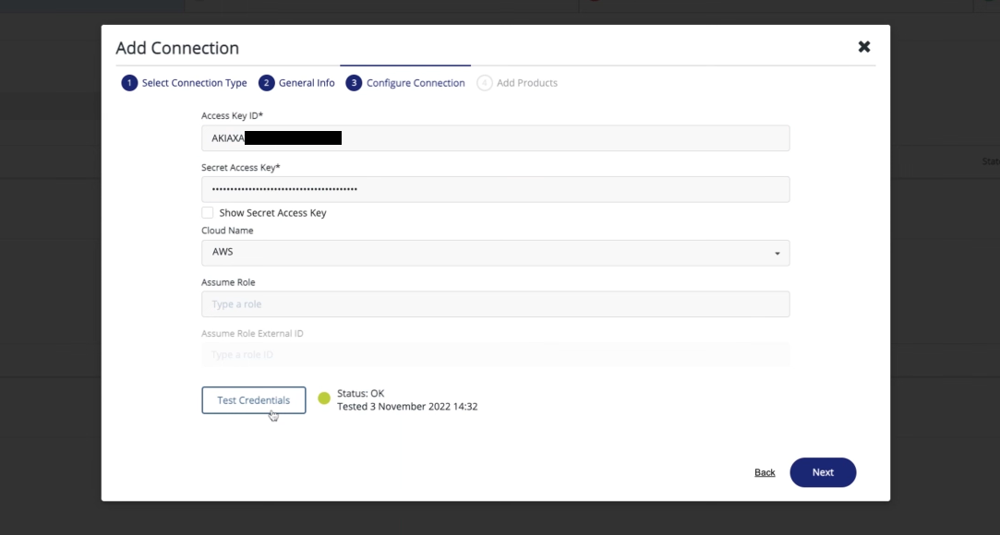
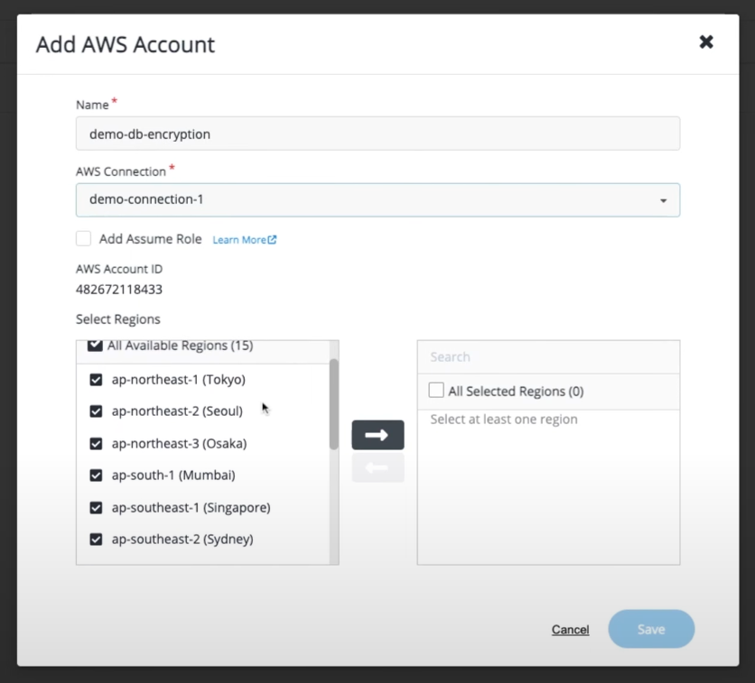
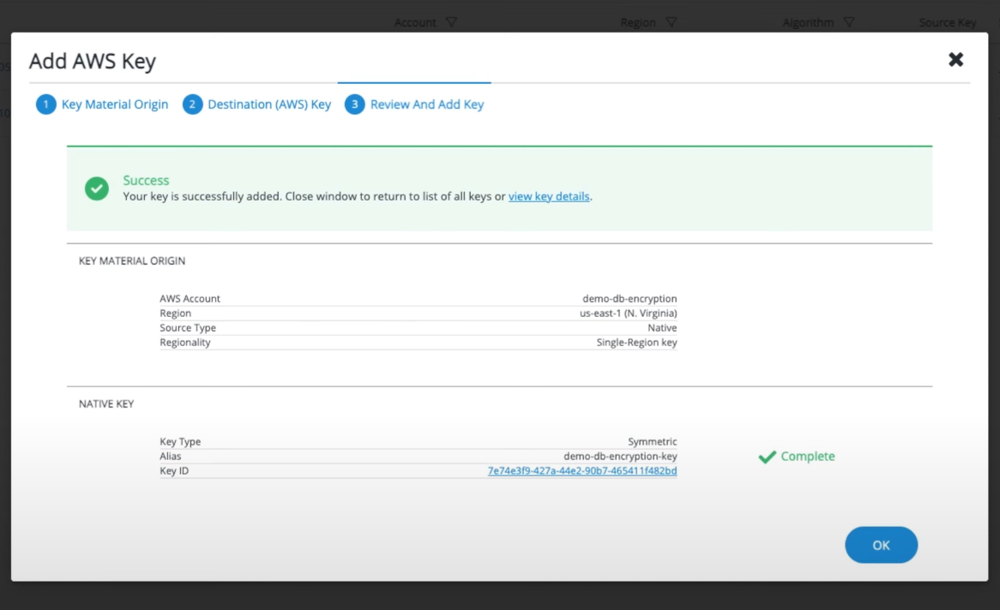

# Encrypt RDS with AWS KMS

import YoutubeEmbed from '@site/src/components/YoutubeEmbed';

<YoutubeEmbed embedId="9Cs9s7DpJFU" />

## Pre-requisites
- [Deployed Ciphertrust Manager instance](../category/deploy-ciphertrust-platform)

### Goals
- Setup CipherTrust Cloud Key Manager (CCKM) with AWS KMS
- Create Keys on CipherTrust Manager
- Encrypt RDS and S3 with the secure external key manager - CCKM


### Step 1 - Create IAM User Policies
Select the IAM user you want to use to connect with CipherTrust Manager.


Go to the permissions tab and create a new policy with the following permissions.
```json title="AWS IAM Permission JSON"
{
    "Version": "2012-10-17",
    "Statement": [
        {
            "Effect": "Allow",
            "Action": [
                "kms:DisableKey",
                "kms:ListAliases",
                "kms:ListKeyPolicies",
                "kms:ListKeys",
                "kms:ListResourceTags",
                "kms:DescribeKey",
                "kms:GetKeyPolicy",
                "kms:GetKeyRotationStatus",
                "kms:GetParametersForImport",
                "kms:GetPublicKey",
                "kms:TagResource",
                "kms:UntagResource",
                "kms:CancelKeyDeletion",
                "kms:CreateAlias",
                "kms:CreateKey",
                "kms:DeleteAlias",
                "kms:DeleteImportedKeyMaterial",
                "kms:DisableKey",
                "kms:DisableKeyRotation",
                "kms:EnableKey",
                "kms:EnableKeyRotation",
                "kms:ImportKeyMaterial",
                "kms:ScheduleKeyDeletion",
                "kms:UpdateAlias",
                "kms:UpdateKeyDescription",
                "kms:PutKeyPolicy",
                "iam:ListGroups",
                "iam:ListRoles",
                "iam:ListUsers",
                "logs:DescribeLogGroups",
                "logs:FilterLogEvents",
                "ec2:DescribeRegions"
            ],
            "Resource": "*"
        }
    ]
}
```

Create security credentials for the user you just gave permissions to. More information on how to get security credentials of an IAM user [here](https://docs.aws.amazon.com/IAM/latest/UserGuide/id_credentials_access-keys.html).

### Step 2 - Setup CipherTrust <-> AWS connection
Now in CipherTrust Manager. Go to "Access Management -> Connections -> + New Connection". Click on the button to create a new connection.

Select the `AWS` option in the given choices.


Add your security credentials in to the form and click on `Test Connection` to make sure the credentials provided work.



### Step 3 - Create keys using new CipherTrust connection
Under the add products section select the `Cloud Key Manager` option to enable CipherTrust Cloud Key Manager features to apply to your new connection.


Under the `containers` tab on the left panel, click on the `AWS Accounts` button and add a new `AWS Account`. Now select the AWS connection we just created in the drop down and select the regions you want this key to be accessible.


You should have successfully added your KMS account to CipherTrust!

Now, head over to `Cloud Keys` -> `AWS` to create a new key. Click on create key and walk through the options to create the type of key you need for your use-case. \
Once you've successfully created the key, you should see a screen similar to this.


That's it, now you can use this newly created key in any AWS services.

### (Optional) Step 4 - Encrypt AWS S3 bucket with the keys from CipherTrust
When you create a new AWS S3 bucket on the AWS console, under `Encryption` configuration, you should see the new key we just created on CipherTrust


That's it, now every file uploaded to the newly created S3 bucket will be encrypted with our key managed on CipherTrust Manager.

import TutorialFooter from '@site/src/components/TutorialFooter';

<TutorialFooter />